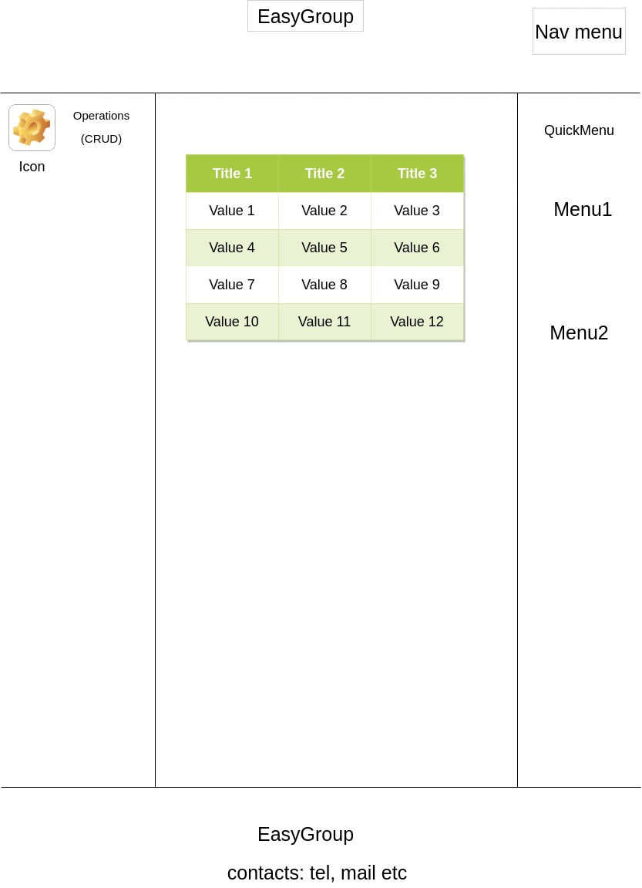

# crowdproj-product-general

Prod-general is a microservice for defining product general, describing common properties for similar products. Ready SAAS
solution for marketplaces.

## What's new in the project
Compared to the previous version , the following changes have appeared: not yet

## Visual schema of frontend

## Documentation 
1. Marketing
   1. [Stakeholders list](./docs/marketing/StakeholdersList.md)
   2. [Target group](./docs/marketing/TargetGroup.md)
   3. [Competitive analysis](./docs/marketing/CompetiveAnalysis.md)
   4. [Economic analysis](./docs/marketing/EconomicAnalysis.md)
   5. [User stories](./docs/marketing/UserStories.md)
2. Devops
   1. [Infrastructure schema](./docs/devops/InfrastructureSchema.md)
   2. [Monitoring schema](./docs/devops/MonitoringSchema.md)
3. Tests 
4. Architecture
   1. [Component schema](./docs/architecture/ComponentSchema.md)
   2. [Integration schema](./docs/architecture/IntegrationSchema.md)
   3. [API description](./docs/architecture/APIDescription.md)

    
